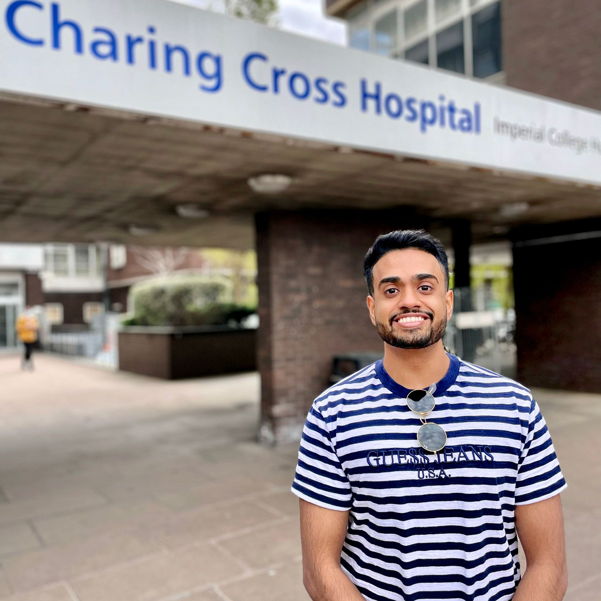
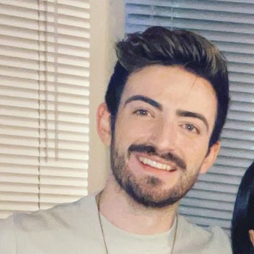

## Dr Anchit Chandran

<figure markdown>
  { width="300" align=left}
  <figcaption>MediCode Founder</figcaption>[:fontawesome-brands-twitter:](https://twitter.com/Anchit171) [:fontawesome-brands-linkedin:](https://www.linkedin.com/in/anchitchandran/)
</figure>

Anchit is an ex-doctor who graduated from Imperial College School of Medicine and Imperial Business School and is currently freelancing as a clinical software developer, focussing on Python projects to improve healthcare outcomes. He entered  Medicine to realise positive change on a societal level. However, working in the NHS, he experienced too many barriers and inefficiencies preventing large-scale sustainable change. So instead, he's turning to an outside-in approach through a pivot into healthcare software development.

His favourite language is Python, which he learned through self-teaching from online resources. Though anyone *can* learn to code for free, he founded MediCode when realising there were no tutorials catered to medics. He also has experience with languages such as HTML/CSS/JavaScript, R, and SQL. He holds an internship with Great Ormond Street Hospital's data science team, DRIVE, and is also freelancing as a clinical software developer for clients such as the RCPCH.

His main interests are data science and machine learning. His career aspirations involve applying computational methods to understand the mind, improve mental health, and explore consciousness.

## Kieran Vail

<figure markdown>
  { width="300" align=left}
  <figcaption>MediCode Tutor</figcaption>[:fontawesome-brands-twitter:](https://twitter.com/kieran_vail) [:fontawesome-brands-linkedin:](https://www.linkedin.com/in/kieran-vail-696452135/)
</figure>

Kieran is a scientist by training, having graduated from Oxford University with a degree in Biology in 2017. Afterwards, he worked in technology consulting as a Data Scientist for four years before returning to university to study graduate entry Medicine at St George’s last year. However, with doubts about the longevity of a career in the NHS, he decided to pivot his career ambitions out of clinical medicine and into other healthcare ventures. Currently, he is working as a Founder Associate at a startup pharmaceutical company. His work involves assisting the founders in setting strategic direction and growing the company organically and inorganically.

Kieran first learned the principles of coding during his undergraduate degree, where he used R for statistical analysis of collected data in numerous lab projects and in his final year dissertation. After university, he learned to code in Python through his data science work and has used online resources since then to consistently build and expand on those skills.

Alongside his interest in extracting insights from data through exploratory analysis and machine learning, Kieran’s passion for programming lies in using code to create novel solutions to problems. This is reflected in his day-to-day work, where solving a business problem will usually involve opening up a Jupyter notebook to do some experimentation!
